# Whale Xe - Car Rental Application

*Drive Your Journey with Effortless Car Rentals*

Built with the tools and technologies:

## Website
https://car-app-web-design.vercel.app/

## Team Member
<li>Trần Ngọc Quân - 23020020</li>
<li>Ngô Hoàng Nhật Khang - 23020004</li>
<li>Phan Thị Thùy Nhung - 23020006</li>
<li>Trần Minh Hoàng	- 23020011</li>
<li>Hồ Anh Tuấn	- 23020016</li>

## Overview
Whale Xe is a modern, responsive web application for car rentals built with Next.js and Tailwind CSS. The platform allows users to search for vehicles, compare options, and make reservations seamlessly with an intuitive interface and comprehensive features. It is associated with various car rental brands and provides a complete booking experience.

## 🏠 Main Features

### 🎯 Homepage
- **🔍 Search Cars Button**: Navigate to comprehensive vehicle listing with advanced filters
- **⭐ Featured Vehicles**: Highlighted premium and popular options
- **🎉 Promotional Offers**: Special deals and discounts display
- **📰 Latest News**: Recent updates and announcements display
- **❓ Frequently Asked Questions**: Common queries and helpful answers display
- **📞 Get in Touch**: Contact options and inquiry form display

### 🔍 Vehicle Search & Booking Page
- **📍 Location & Date Selection**: Easy input for pickup/return details
- **🎛️ Advanced Filters**: 
  - 🚗 Vehicle Type
  - 🏷️ Brand
  - 🪑 Seats
  - ⛽ Fuel Type
  - 💸 Discounts
  - 💰 Price: 0 — 10,000,000
- **🔎 Search Button**: Find vehicles based on keywords
- **📄 Pagination**: Smooth navigation through vehicle listings

---

## 👤 User Functions

### 🎨 **Frontend Experience**
- **🏡 Beautiful Homepage**: Categorized vehicle display
  - ⭐ Featured vehicles
  - 💰 Economy options
  - 👑 Luxury collection

### 🔧 **Search & Filter System**
- **🎛️ Advanced Filters**: Type, brand, seats, fuel, discount, price

### 👥 **User Management**
- **📝 Registration & Login**: Secure account creation and authentication
- **🛒 Booking Cart**: Add multiple vehicles for comparison
- **👤 User Profile**: Personal information and preferences
- **📚 Rental History**: Track past and current bookings
- **❤️ My Favourite**: Your saved or preferred vehicles display

---

## 👨‍💼 Admin Functions

### 📊 **Analytics Dashboard**
- **📈 Overview**: Quick insights on rentals, revenue, and performance
- **🚗 Vehicle List**: Full inventory management and vehicle details
- **📋 Rental Orders**: Track, manage, and fulfill rental orders

## Admin Account:
+ Phone number: 0998877665
+ Password: admin123

## Screenshots

### Homepage
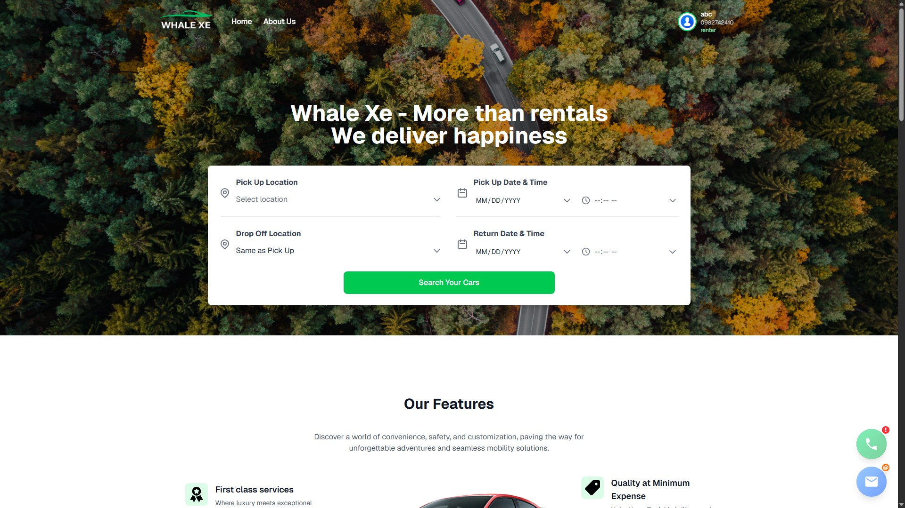

### Loading Screen
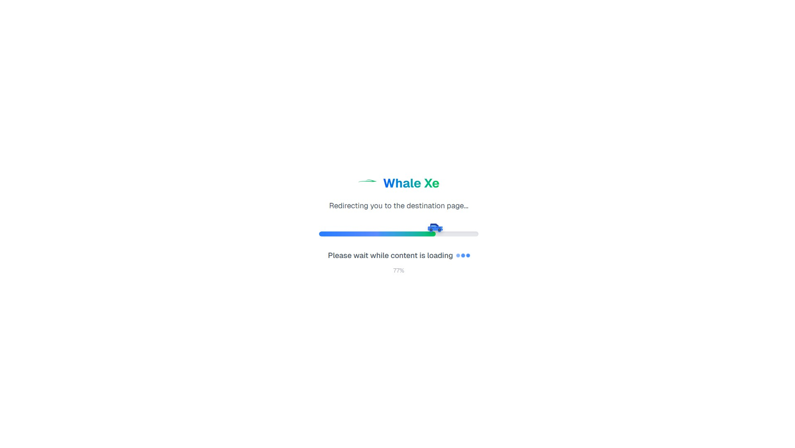

### Sign In / Sign Up
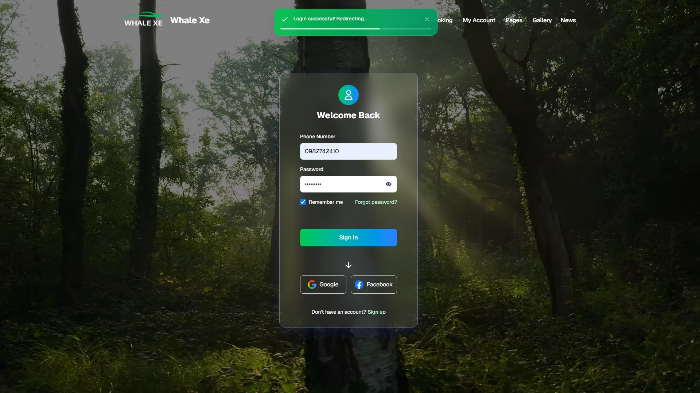

### Car List
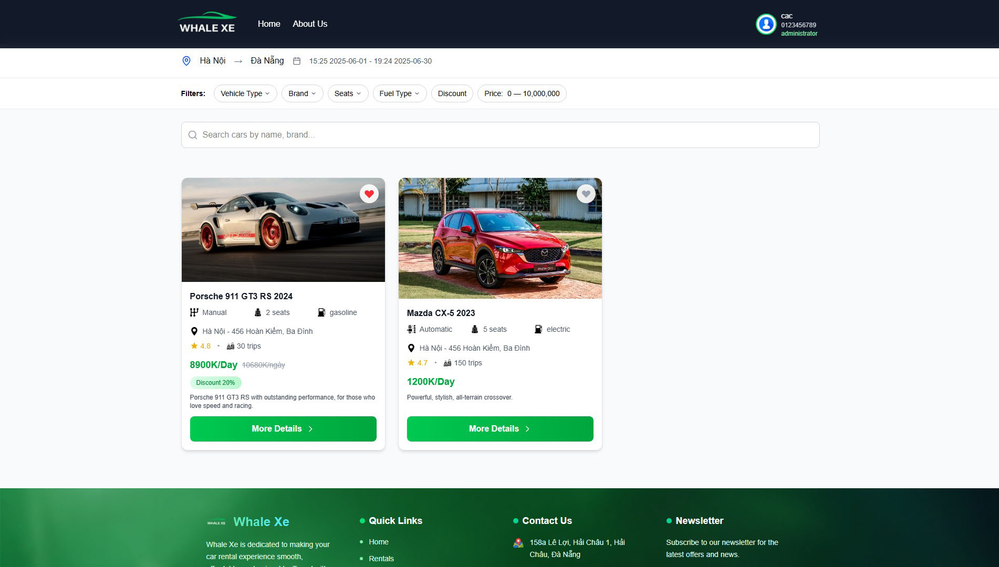

### User Dashboard
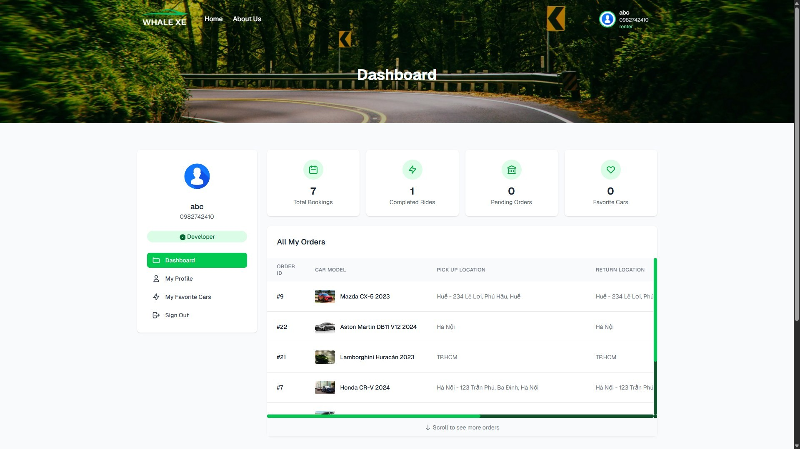

### User Profile Update
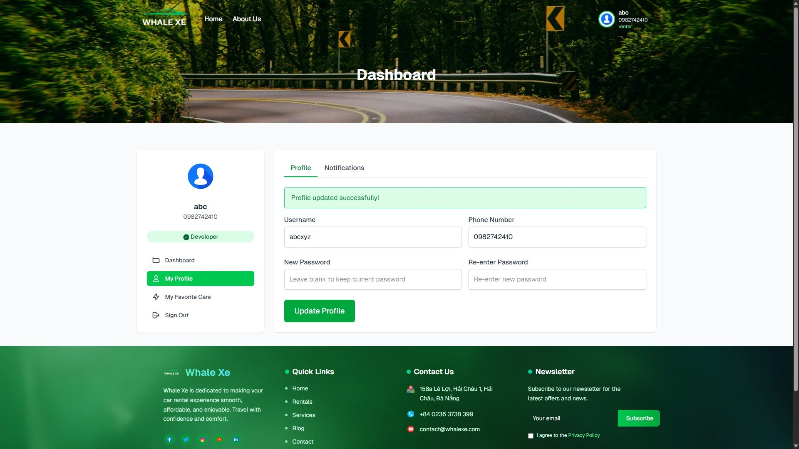

### User Favorite List

### Car Detail

### Trip Information
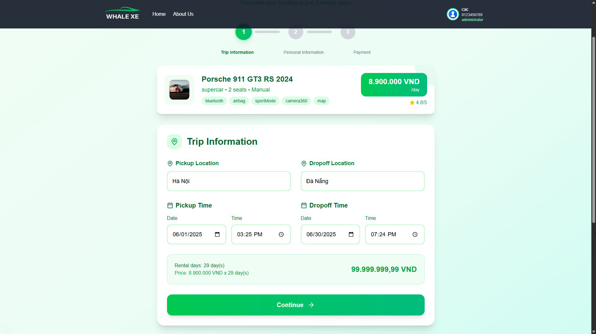

### Personal Information
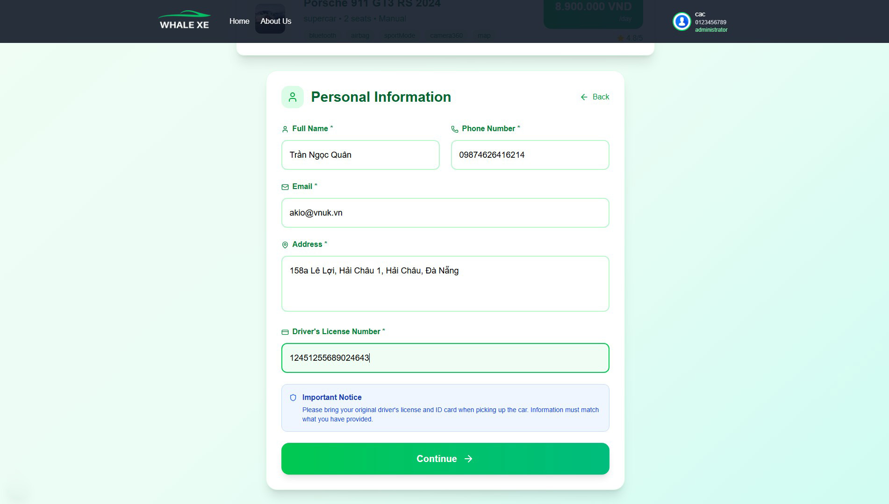

### Payment
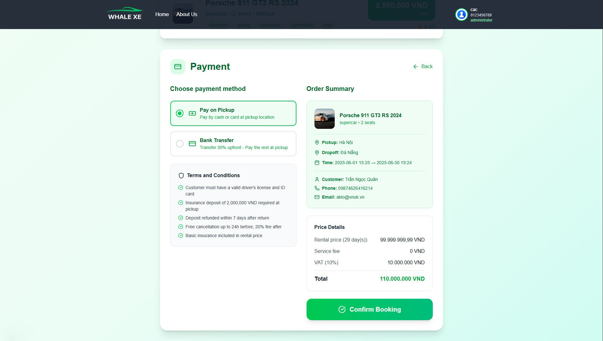

### Booking Ticket
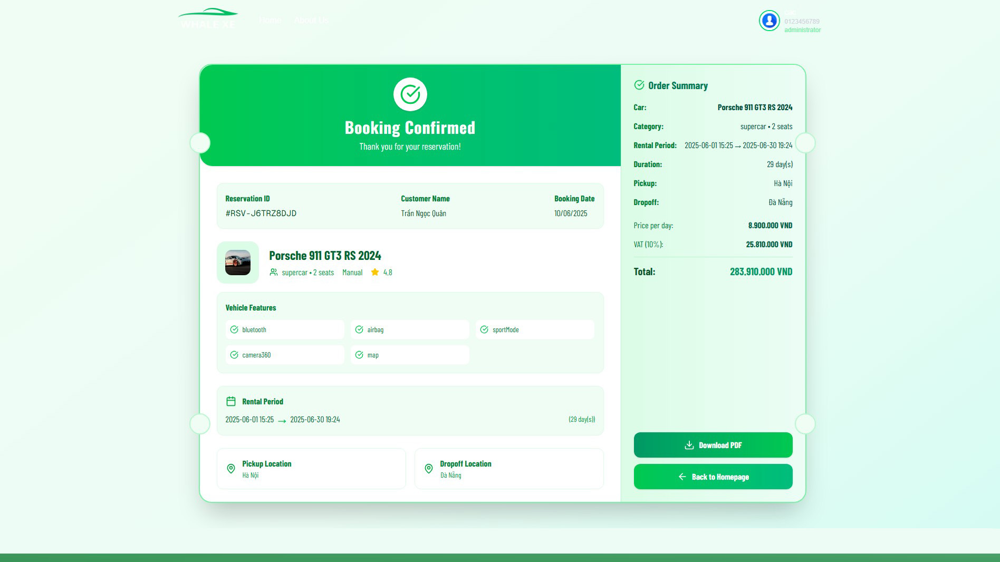

### About Us
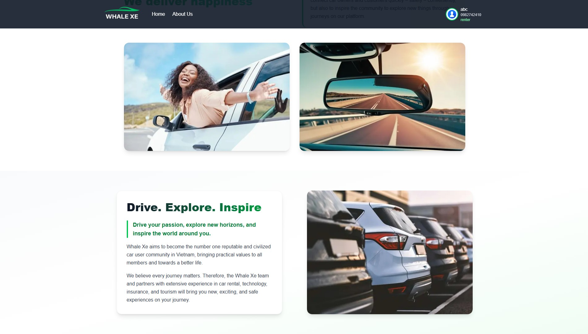

### Admin Dashboard
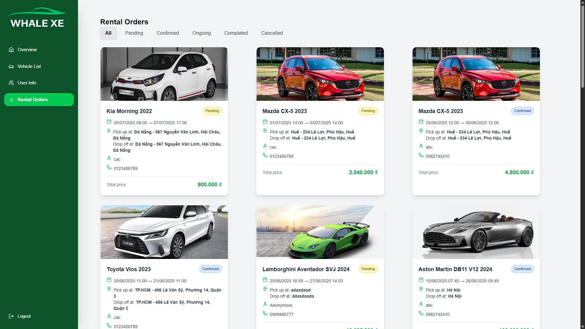
